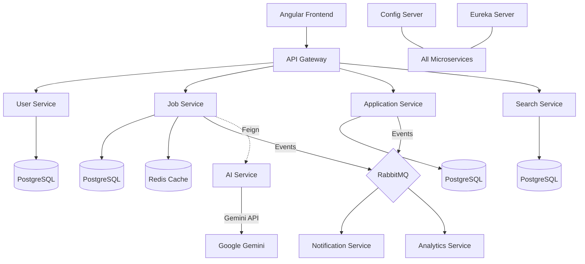

# High-Level Design (HLD) - Job Portal Microservices Platform

## 1. Document Information
- **Project Name:** Job Portal Microservices
- **Version:** 1.1.0
- **Status:** Final
- **Date:** 2026-04-27
- **Author:** Antigravity AI

---

## 2. Executive Summary
The Job Portal Microservices Platform is a distributed, scalable, and highly available web application designed to connect job seekers with employers. Unlike traditional monolithic job portals, this system is built using a modern microservices architecture, allowing for independent scaling of features like search, application processing, and AI-driven matching.

The platform leverages the Spring Cloud ecosystem for service orchestration, PostgreSQL for persistent storage, RabbitMQ for asynchronous event-driven communication, and Redis for high-performance caching. The frontend is a responsive Angular application that provides a seamless user experience.

---

## 3. Goals and Objectives
### 3.1. Primary Goals
- **Scalability:** To handle thousands of concurrent users and job postings.
- **Availability:** To ensure the system remains operational even if individual services fail.
- **Maintainability:** To allow independent development and deployment of different modules.
- **AI Integration:** To provide intelligent job recommendations and resume parsing.

### 3.2. Business Objectives
- Provide a platform for recruiters to post jobs and manage candidates.
- Enable job seekers to create profiles, upload resumes, and apply for jobs.
- Facilitate real-time notifications for application updates.
- Offer advanced search capabilities based on location, skills, and salary.

---

## 4. Technology Stack
The platform uses a "Best of Breed" approach, selecting technologies that excel in their respective domains.

### 4.1. Frontend
- **Framework:** Angular 17+
- **Language:** TypeScript
- **State Management:** RxJS Observables
- **Styling:** CSS3 / SCSS
- **Build Tool:** Angular CLI / Webpack

### 4.2. Backend (Microservices)
- **Framework:** Spring Boot 3.x
- **Language:** Java 17+
- **Service Discovery:** Netflix Eureka
- **Configuration:** Spring Cloud Config Server
- **API Gateway:** Spring Cloud Gateway
- **Communication:**
    - **Synchronous:** Spring Cloud OpenFeign
    - **Asynchronous:** RabbitMQ (AMQP)
- **Security:** Spring Security, JWT (JSON Web Tokens)
- **Resilience:** Resilience4j (Circuit Breaker)

### 4.3. Data Storage & Caching
- **Primary Database:** PostgreSQL 15+ (Relational data)
- **Caching:** Redis 7 (Job search results and session data)
- **File Storage:** Local/S3 (For resumes)

### 4.4. AI & Analytics
- **AI Model:** Google Gemini API (via AI-Service)
- **Analytics:** Custom Analytics Service with event tracking.

### 4.5. DevOps & Infrastructure
- **Containerization:** Docker
- **Orchestration:** Docker Compose
- **Build Tool:** Maven
- **CI/CD:** SonarQube (Static Analysis), JaCoCo (Test Coverage)

---

## 5. System Architecture
The system follows a microservices architectural pattern with a clear separation between the edge layer, platform layer, and application layer.

### 5.1. Architectural Layers

#### 5.1.1. Edge Layer (Gateway)
The **API Gateway** acts as the single entry point for all client requests. It handles:
- Request routing to appropriate microservices.
- Authentication validation (JWT).
- Rate limiting.
- Cross-Origin Resource Sharing (CORS) configuration.

#### 5.1.2. Platform Layer (Infrastructure Services)
- **Eureka Server:** Service registry where all microservices register themselves.
- **Config Server:** Centralized configuration management using a Git/File-based backend.

#### 5.1.3. Application Layer (Core Business Services)
Each service is autonomous with its own database (Database-per-Service pattern).
- **User Service:** Manages users, roles, and profiles.
- **Job Service:** Manages job lifecycle (Post, Update, Delete).
- **Application Service:** Manages the job application process.
- **Resume Service:** Handles resume parsing and storage.
- **Search Service:** Optimized search for jobs.
- **Notification Service:** Sends emails/SMS via RabbitMQ events.
- **AI Service:** Provides AI-driven features like job matching.

### 5.2. Component Diagram (Conceptual)


---

## 6. Module Deep Dive

### 6.1. User Service
**Purpose:** Handles all user-related operations, including registration, login, and profile management.
- **Key Entities:** User, Role, Profile.
- **Responsibilities:**
    - Password hashing using BCrypt.
    - Generating JWT tokens upon successful login.
    - Managing user roles (ADMIN, RECRUITER, JOB_SEEKER).
    - Profile management (Skills, Experience, Education).
- **Endpoints:**
    - `POST /api/users/register`
    - `POST /api/users/login`
    - `GET /api/users/profile/{id}`

### 6.2. Job Service
**Purpose:** Manages the core entity of the platform: Job Postings.
- **Key Entities:** Job, Category, Location.
- **Responsibilities:**
    - CRUD operations for jobs.
    - Caching frequently accessed job listings in Redis.
    - Publishing "Job Created" events to RabbitMQ for indexing and notifications.
- **Integrations:**
    - Uses Redis for performance optimization.
    - Communicates with AI service for matching scores.

### 6.3. Application Service
**Purpose:** Orchestrates the process of applying for a job.
- **Key Entities:** Application, ApplicationStatus.
- **Responsibilities:**
    - Validating if a user has already applied for a job.
    - Linking applicants with job postings.
    - Managing status transitions (APPLIED, SCREENING, INTERVIEW, OFFER, REJECTED).
    - Triggering notifications on status changes.
- **Communication:**
    - Uses OpenFeign to verify user and job existence.

### 6.4. Search Service
**Purpose:** Provides a high-performance search engine for job listings.
- **Responsibilities:**
    - Maintaining a search-optimized database schema.
    - Listening to RabbitMQ events to keep search data in sync with the Job Service.
    - Advanced filtering (Remote, Salary Range, Experience Level).

### 6.5. Resume Service
**Purpose:** Dedicated service for handling documents.
- **Responsibilities:**
    - Securely storing resume files.
    - Parsing text from resumes (often in collaboration with the AI Service).
    - Generating downloadable links for recruiters.

### 6.6. Notification Service
**Purpose:** Handles all outbound communications.
- **Responsibilities:**
    - Consuming messages from RabbitMQ.
    - Sending emails for registration, application status changes, and job alerts.
    - Implementing retry logic with Dead Letter Queues (DLQ).

### 6.7. AI Service
**Purpose:** Enhances the platform with intelligent features.
- **Responsibilities:**
    - Interfacing with the Gemini API.
    - Job-Candidate matching (scoring).
    - Resume improvement suggestions.
    - Skill gap analysis.

---

## 7. Data Flow and Communication

### 7.1. Authentication Flow
1. User submits credentials to `api-gateway`.
2. Gateway routes request to `user-service`.
3. `user-service` validates credentials and returns a JWT.
4. Client stores JWT and includes it in the `Authorization` header for subsequent requests.
5. Gateway validates the JWT signature before routing any further requests.

### 7.2. Job Posting Flow (Event-Driven)
1. Recruiter creates a job via `job-service`.
2. `job-service` saves the job to `job_db`.
3. `job-service` publishes a `JOB_CREATED` event to a RabbitMQ exchange.
4. `search-service` consumes the event and indexes the job.
5. `notification-service` consumes the event and sends alerts to matching candidates.

### 7.3. Synchronous Communication (Feign)
- When a user applies for a job, `application-service` calls `user-service` via Feign to get user details.
- `application-service` calls `job-service` to ensure the job is still open.

---

## 8. Database Design Principles
The system uses **Database-per-Service**. This prevents tight coupling and allows each service to use the most suitable data model.

- **Isolation:** No service can directly access another service's database.
- **Consistency:** Eventual consistency is achieved using RabbitMQ.
- **Schema Management:** Each service manages its own migrations (Hibernate `ddl-auto` for dev, Flyway/Liquibase for prod).

---

## 9. Security Architecture
### 9.1. Edge Security
The API Gateway handles the heavy lifting of security:
- **JWT Parsing:** Extracts and validates user claims.
- **Path Protection:** Restricts sensitive endpoints to specific roles.

### 9.2. Internal Security
- **Service-to-Service:** In a production environment, services would communicate over HTTPS or within a private VPC network.
- **Secret Management:** Sensitive data like DB passwords and API keys are managed by the Config Server (secured with encryption).

---

## 10. Scalability and Reliability
### 10.1. Horizontal Scaling
All microservices are stateless, allowing multiple instances to run behind a load balancer (handled by Spring Cloud Gateway and Eureka).

### 10.2. Resilience (Circuit Breaker)
Resilience4j is used to prevent cascading failures. If the `notification-service` is down, the `application-service` won't hang; it will fall back to a default behavior (e.g., logging the failure) while the circuit is open.

### 10.3. Caching Strategy
Redis is used for:
- **Read-Heavy Data:** Job listings, user profiles.
- **Distributed Session:** Ensuring consistent user state across gateway instances.

---

## 11. Project Roadmap

### Phase 1: Foundation (Completed)
- Setup Eureka and Config Servers.
- Implement User and Job core services.
- Basic API Gateway routing.
- Dockerization of core services.

### Phase 2: Core Features (In Progress)
- Implementation of Application and Resume services.
- Integration of RabbitMQ for notifications.
- Deployment of Search Service with basic filters.
- JWT-based security implementation.

### Phase 3: Advanced Integration (Future)
- AI-Service integration for Gemini-powered matching.
- Advanced Analytics dashboard for recruiters.
- Implementation of Dead Letter Queues (DLQ) for all messaging.
- Frontend polish and responsive design completion.

### Phase 4: Optimization and Scale (Future)
- Kubernetes migration for orchestration.
- Implementation of ELK stack (Elasticsearch, Logstash, Kibana) for centralized logging.
- Performance tuning of PostgreSQL queries and Redis caching.

---

## 12. Detailed API Inventory (Sample)

### User Service
| Method | Endpoint | Description | Role |
|--------|----------|-------------|------|
| POST | `/api/users/register` | Register a new user | Public |
| POST | `/api/users/login` | Authenticate and get JWT | Public |
| GET | `/api/users/profile/{id}` | Get profile details | Authenticated |

### Job Service
| Method | Endpoint | Description | Role |
|--------|----------|-------------|------|
| POST | `/api/jobs` | Create a new job listing | RECRUITER |
| GET | `/api/jobs/{id}` | Get job details | Public |
| PUT | `/api/jobs/{id}` | Update job listing | RECRUITER |

### Application Service
| Method | Endpoint | Description | Role |
|--------|----------|-------------|------|
| POST | `/api/applications` | Apply for a job | JOB_SEEKER |
| GET | `/api/applications/user/{id}` | Get user's applications | JOB_SEEKER |
| PATCH| `/api/applications/{id}/status` | Update status | RECRUITER |

---

## 13. Infrastructure Setup (Docker Compose)
The platform uses a unified `docker-compose.yml` to spin up the entire ecosystem.

- **Network:** `jobportal-network` (Bridge)
- **Persistence:** Postgres volumes mapped to host.
- **Dependency Management:** Services use `healthcheck` and `depends_on` (service_healthy) to ensure correct startup order.

---

## 14. Performance Considerations
- **Pagination:** All list endpoints (Jobs, Applications) implement pagination.
- **Index Optimization:** Database indexes on `job_id`, `user_id`, and `status`.
- **Async Processing:** Heavy tasks like sending emails are offloaded to background workers.

---

## 15. Conclusion
The Job Portal Microservices Platform represents a modern approach to web application development. By utilizing Spring Cloud, RabbitMQ, and a microservices architecture, the system achieves the flexibility and scalability required for a high-traffic professional network. The integration of AI features further positions the platform as a next-generation solution in the job market.

---

## 16. Appendix
### A. Glossary
- **Eureka:** Netflix's service discovery tool.
- **Feign:** A declarative HTTP client.
- **RabbitMQ:** An open-source message-broker software.
- **JWT:** JSON Web Token for secure information transmission.

### B. Development Guidelines
- Follow SOLID principles.
- Ensure 80% unit test coverage using JaCoCo.
- Use SonarQube for continuous code quality monitoring.

---

## 17. Detailed Data Schema (Logical)

### User Service Schema
- **Users Table:**
    - `id` (UUID, PK)
    - `username` (String, Unique)
    - `password` (String, Encrypted)
    - `email` (String, Unique)
    - `role` (Enum: ADMIN, RECRUITER, JOB_SEEKER)
    - `created_at` (Timestamp)
- **Profiles Table:**
    - `id` (UUID, PK)
    - `user_id` (FK -> Users)
    - `full_name` (String)
    - `phone` (String)
    - `summary` (Text)
    - `skills` (JSONB/String)

### Job Service Schema
- **Jobs Table:**
    - `id` (Long, PK)
    - `title` (String)
    - `description` (Text)
    - `company_name` (String)
    - `location` (String)
    - `salary_range` (String)
    - `posted_by` (UUID, FK -> User Service User ID)
    - `status` (Enum: OPEN, CLOSED)
    - `created_at` (Timestamp)

### Application Service Schema
- **Applications Table:**
    - `id` (Long, PK)
    - `job_id` (Long)
    - `user_id` (UUID)
    - `resume_url` (String)
    - `status` (Enum: APPLIED, REJECTED, SHORTLISTED)
    - `applied_at` (Timestamp)

---

## 18. Messaging Protocol (RabbitMQ Details)

### Exchanges
- `job.exchange`: Topic exchange for job-related events.
- `application.exchange`: Direct exchange for application events.

### Queues
- `search.queue`: Bound to `job.exchange` (routing key: `job.created`).
- `notification.job.queue`: Bound to `job.exchange` (routing key: `job.created`).
- `notification.app.queue`: Bound to `application.exchange` (routing key: `application.status.change`).

---

## 19. Detailed Component Responsibilities (Expanded)

### 19.1. API Gateway Logic
The API Gateway is not just a proxy. It performs:
- **Global Filters:** Logs request latency and correlation IDs for tracing.
- **Security Filters:** Validates the presence of a valid JWT in the `Authorization` header.
- **Fallback Logic:** Redirects to a static "Service Unavailable" page if a downstream service is unresponsive.

### 19.2. Config Server Strategy
- **Profiles:** Uses `docker`, `dev`, and `prod` profiles.
- **Encryption:** Uses JCE (Java Cryptography Extension) to encrypt sensitive properties like `spring.datasource.password`.

### 19.3. Eureka Server Configuration
- **Self-Preservation:** Enabled to handle network partitions gracefully.
- **Health Checks:** Configured for 30-second heartbeats from all clients.

---

## 20. Resilience Patterns

### 20.1. Circuit Breaker Configuration
- **Failure Rate Threshold:** 50%
- **Wait Duration in Open State:** 60 seconds
- **Permitted Number of Calls in Half-Open State:** 10

### 20.2. Retry Mechanisms
- Configured for idempotent operations like `GET` requests to the User Service.
- Max Attempts: 3
- Backoff: Exponential (2s, 4s, 8s).

---

## 21. Deployment Workflow (DevOps)

### Step 1: Code Commit
- Developer pushes code to Git.
- CI trigger runs Maven tests and JaCoCo coverage reports.

### Step 2: Quality Gate
- SonarQube analyzes the code for bugs, vulnerabilities, and code smells.
- Build fails if Quality Gate criteria are not met.

### Step 3: Containerization
- Maven build generates a JAR.
- Dockerfile wraps the JAR into a lightweight Alpine-based image.
- Image is pushed to a private registry (or local Docker daemon).

### Step 4: Orchestration
- `docker-compose up` orchestrates the startup sequence.
- Infrastructure services (Postgres, RabbitMQ, Redis) start first.
- Platform services (Eureka, Config) start next.
- Application services start last.

---

## 22. User Interface Design (Angular)

### 22.1. Component Architecture
- **Core Module:** Singleton services (AuthService, TokenService, Logger).
- **Shared Module:** Reusable UI components (Navbar, Footer, Spinner).
- **Feature Modules:** Lazy-loaded modules for JobSeeker, Recruiter, and Admin flows.

### 22.2. Interceptors
- **AuthInterceptor:** Automatically attaches JWT to all outgoing HTTP requests.
- **ErrorInterceptor:** Handles global 401/403/500 errors and displays user-friendly messages.

### 22.3. Guards
- **AuthGuard:** Prevents unauthenticated users from accessing profile pages.
- **RoleGuard:** Ensures only Recruiters can access the "Post Job" page.

---

## 23. Testing Strategy

### 23.1. Unit Testing
- Mockito and JUnit 5 for isolating service logic.
- Target: 80%+ coverage.

### 23.2. Integration Testing
- Testcontainers for running ephemeral Postgres instances during Maven build.
- `MockMvc` for testing controller endpoints.

### 23.3. End-to-End (E2E) Testing
- Selenium/Cypress for testing the Angular frontend flow through the Gateway to the backend.

---

## 24. Monitoring and Logging

### 24.1. Actuator Endpoints
- Each service exposes `/actuator/health`, `/actuator/metrics`, and `/actuator/info`.
- Used by the Gateway and external monitoring tools.

### 24.2. Centralized Logging (Future)
- Planned implementation of the ELK stack.
- Logback configuration sends logs in JSON format for easy ingestion by Logstash.

---

## 25. Scalability Considerations (Deep Dive)

### 25.1. Database Sharding
- As the volume of job applications grows, the Application Service database can be sharded by `job_id`.

### 25.2. Redis Cluster
- Transition from a single Redis node to a Redis Cluster for high availability of cached job listings.

### 25.3. Load Balancing
- Client-side load balancing via Spring Cloud LoadBalancer (integrated with Feign).
- Server-side load balancing at the Gateway level.

---

## 26. Environmental Variables Inventory

| Variable | Description | Default/Example |
|----------|-------------|-----------------|
| `SPRING_PROFILES_ACTIVE` | Active environment profile | `docker` |
| `SPRING_DATASOURCE_URL` | DB Connection URL | `jdbc:postgresql://postgres:5432/...` |
| `RABBITMQ_HOST` | RabbitMQ Broker Address | `rabbitmq` |
| `JWT_SECRET` | Secret key for JWT signing | `[REDACTED]` |
| `CONFIG_SERVER_URL` | URL for Spring Cloud Config | `http://config-server:8888` |

---

## 27. Failure Modes and Mitigation

| Potential Failure | Mitigation Strategy |
|-------------------|---------------------|
| Config Server Down | Use "fail-fast: false" and cached local configuration. |
| RabbitMQ Down | Implement local outbox pattern or retry with backoff. |
| Database Latency | Use Redis for read-heavy operations; optimize indexes. |
| Gateway Failure | Deploy multiple Gateway instances behind a hardware load balancer. |

---

## 28. Future Proofing
The architecture is designed to be cloud-agnostic. While currently running on Docker Compose, the transition to Amazon EKS (Elastic Kubernetes Service) or Azure Kubernetes Service (AKS) would require minimal code changes, primarily focusing on manifest files (YAML) for Kubernetes.

---

## 29. Change Log
- **1.0.0:** Initial High-Level Design document created.
- **1.1.0:** Expanded with Development Guidelines, Troubleshooting, and Performance Tuning.

---

## 30. Detailed Development Guidelines

### 30.1. Code Style and Standards
- **Java:** Follow the Google Java Style Guide. Use Lombok for reducing boilerplate (Getters, Setters, Constructors).
- **Angular:** Follow the official Angular Style Guide. Use `PascalCase` for components and `camelCase` for variables/methods.
- **Microservices:** Ensure all services are stateless. Any session-related data must be stored in Redis.

### 30.2. Exception Handling
- **Global Exception Handler:** Every microservice must have a `@ControllerAdvice` to handle exceptions globally and return consistent error responses.
- **Standard Error Response:**
    ```json
    {
      "timestamp": "2026-04-27T10:00:00",
      "status": 404,
      "error": "Not Found",
      "message": "Job with ID 123 not found",
      "path": "/api/jobs/123"
    }
    ```

### 30.3. Logging Best Practices
- **Correlation IDs:** Every request must carry an `X-Correlation-ID` header. This ID should be logged at every step across all microservices for distributed tracing.
- **Log Levels:**
    - `INFO`: For significant lifecycle events (service start, request completion).
    - `DEBUG`: For detailed logic execution (only for dev/test).
    - `WARN`: For non-critical failures (validation errors).
    - `ERROR`: For critical failures (database down, unexpected exceptions).

---

## 31. Troubleshooting Guide

### 31.1. Service Registration Issues
- **Symptoms:** Gateway returns 404 or "Service Unavailable" even if the service is running.
- **Solutions:**
    - Check the Eureka dashboard at `http://localhost:8761`.
    - Ensure `spring.application.name` matches the Gateway route configuration.
    - Check network connectivity between containers in the `jobportal-network`.

### 31.2. Configuration Not Loading
- **Symptoms:** Service starts with default values instead of those defined in the Config Server.
- **Solutions:**
    - Verify Config Server is healthy at `http://localhost:8888/actuator/health`.
    - Check the `bootstrap.yml` or `application.yml` for correct `spring.cloud.config.uri`.
    - Ensure the Git/File-based config repository is accessible.

### 31.3. RabbitMQ Connectivity
- **Symptoms:** Events are not being published or consumed.
- **Solutions:**
    - Access the RabbitMQ Management UI at `http://localhost:15672`.
    - Check the "Exchanges" and "Queues" tabs to see if bindings are correctly established.
    - Inspect the Dead Letter Queues (DLQ) for failed messages.

---

## 32. Performance Tuning

### 32.1. JVM Optimization
- Use the G1 Garbage Collector for low-latency requirements.
- Set `-Xms` and `-Xmx` to the same value to prevent heap resizing during runtime.

### 32.2. Database Connection Pooling
- Use HikariCP (default in Spring Boot) for high-performance connection pooling.
- Configure `maximum-pool-size` based on the number of available CPU cores and expected concurrency.

### 32.3. Angular Performance
- Use **OnPush** change detection strategy for presentational components.
- Implement lazy loading for all feature modules to reduce initial bundle size.

---

## 33. Compliance and Security (Deep Dive)

### 33.1. Data Privacy
- **Encryption at Rest:** PostgreSQL should be configured to encrypt data files.
- **PII (Personally Identifiable Information):** Mask sensitive user data (like phone numbers) in logs.

### 33.2. Token Security
- **Short-Lived JWTs:** Tokens should expire within 1 hour.
- **Refresh Tokens:** Implement a refresh token mechanism to allow users to stay logged in without re-authenticating frequently (Future Phase).

---

## 34. Conclusion and Next Steps
This High-Level Design document provides a comprehensive roadmap for building a robust, AI-powered Job Portal. The architecture is modular, allowing the team to iterate quickly on individual components while maintaining overall system stability.

**Immediate Next Steps:**
1. Finalize the AI matching algorithm in the `ai-service`.
2. Implement the frontend dashboard for Recruiters.
3. Conduct a full-scale performance test on the `search-service`.

---
*Document Finalized on 2026-04-27*
